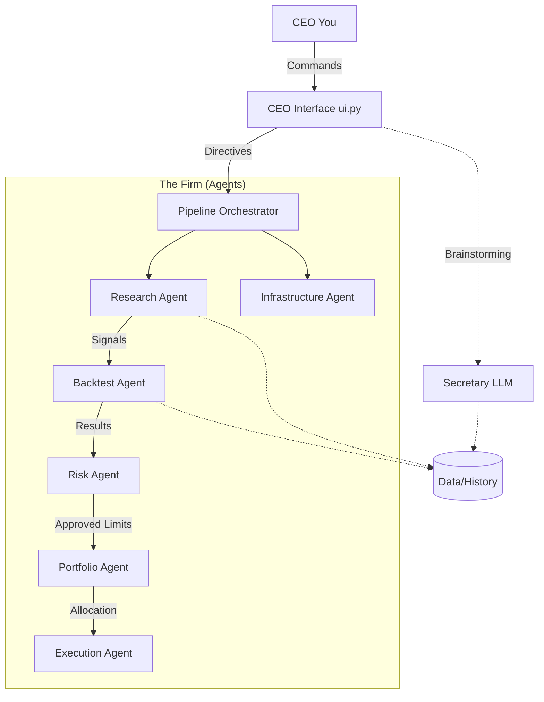

# NETHRUM v4 — Autonomous Multi-Agent Quant Trading System
**"The AI-run Quant Firm"**


---

## 📌 Table of Contents
1. [Overview](#-overview)
2. [System Architecture](#-system-architecture)
3. [Repository Structure](#-repository-structure)
4. [Agent Responsibilities](#-agent-responsibilities)
5. [Quant Strategies](#-quant-strategies)
6. [CEO Interface](#-ceo-interface-uipy)
7. [Getting Started](#-getting-started)
8. [Usage](#-usage)
9. [History System](#-history-system)
10. [Future Enhancements](#-future-enhancements)
11. [Author](#-author)

---

## 🚀 Overview
**Nethrum v4** is a fully autonomous, multi-agent quantitative trading framework designed to operate like a fully automated hedge fund.

At the helm is the **CEO (You)**, directing a team of specialized AI agents. The system includes:

- 🔹 Independent AI Agents: Research, Backtesting, Risk, Execution, Portfolio, Infrastructure  
- 🔹 Secretary LLM: Brainstorms, tags ideas, processes input, and assists the CEO  
- 🔹 Pipeline: Orchestrates and coordinates all agents  
- 🔹 Real Market Data via `yfinance`  
- 🔹 Persistent History: Tracks all signals, simulations, and results  
- 🔹 CEO Console UI: Centralized interface for commanding the firm  

---

## 🧠 System Architecture

## Project Higherarchy
```
nethrum_v4/
│
├── ui.py                     # 🖥️ CEO interface: command bar & dashboard
├── pipeline.py               # ⚙️ Central orchestrator
├── ceo.py                    # 👔 High-level CEO command interpreter
├── secretary.py              # 📝 LLM assistant
├── history_manager.py        # 🗄️ Persistent run & signal storage
│
├── data/                     # 📂 Auto-created logs & historical data
│
└── agents/
    ├── base_agent.py         # 🧱 Shared utilities + parent class
    ├── infrastructure_agent.py # 🛠️ Data integrity, health checks
    ├── quant_algos.py        # 📈 10 quant strategies (Alpha Engine)
    ├── research_agent.py     # 🔎 Data fetching & signal generation
    ├── backtest_agent.py     # ⏱️ Historical simulations
    ├── risk_agent.py         # 🛡️ Risk monitoring & kill-switch logic
    ├── portfolio_agent.py    # ⚖️ Allocation & rebalancing
    └── execution_agent.py    # ⚡ Trade routing & slippage
```

